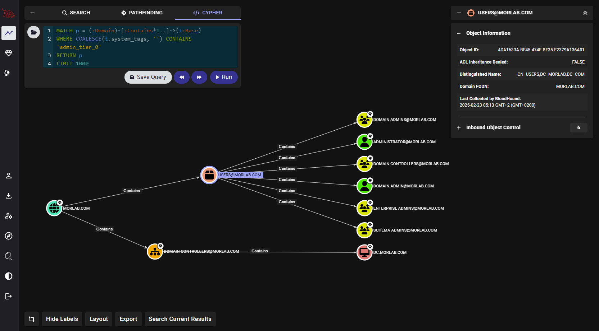

# BloodHound Viewer 

### BloodHound CE Enhancement Extension - A Chrome extension that enhances BloodHound Community Edition with additional features including query history navigation, improved layout controls, and Neo4j button.

### Features

#### Query History Navigation
- **Back/Forward Navigation**: Navigate through your previous Cypher queries using Back and Forward buttons
- **Automatic Query Saving**: Queries are automatically saved when executed
- **Duplicate Prevention**: Prevents duplicate queries from being saved
- **Query Persistence**: History is preserved across sessions using local storage

### Installation
1. Download or clone this repository
2. Open Chrome and navigate to `chrome://extensions/`
3. Enable "Developer mode" in the top right
4. Click "Load unpacked" and select the extension directory

### Usage
After installation, the extension automatically activates when you visit BloodHound CE:
- Use the Back/Forward buttons above the query editor to navigate through your query history
- Click the Neo4j icon in the header to open the Neo4j browser

### Acknowledgments
- Inspired by the history feature from Legacy BloodHound
- Built for the BloodHound Community Edition

## License
This program is distributed in the hope that it will be useful, but WITHOUT ANY WARRANTY; without even the implied warranty of MERCHANTABILITY or FITNESS FOR A PARTICULAR PURPOSE. See the GNU General Public License for more details.

## Upcoming
- AI Support and many more..